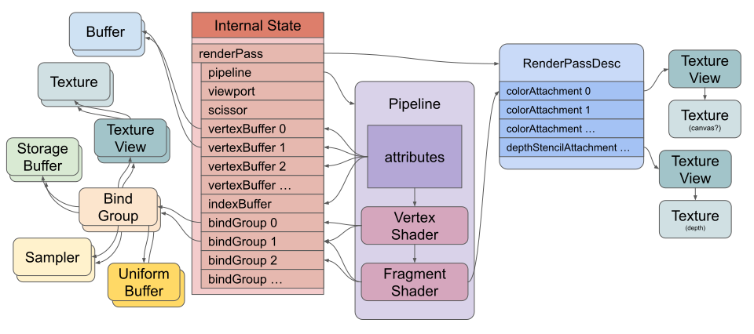

# webgpufundamentals.org

A tutorial on WebGPU.

Link: https://webgpufundamentals.org/webgpu/

This document summarizes and may contain quotes from this site.

## First Article: WebGPU Fundamentals

Link: https://webgpufundamentals.org/webgpu/lessons/webgpu-fundamentals.html

> WebGPU is an extremelty low-level API that lets you do 2 basic things
>
> 1. [Draw triangles/points/lines to textures](https://webgpufundamentals.org/webgpu/lessons/webgpu-fundamentals.html#a-drawing-triangles-to-textures)
> 2. [Run computations on the GPU](https://webgpufundamentals.org/webgpu/lessons/webgpu-fundamentals.html#a-run-computations-on-the-gpu)

There are lots more complex (and seeminly unrelated) stuffs that can be built upon "just" these two really primitive capabilities.

The low-level nature of WebGPU has some noticeable consequences:

- A large amount of applications can be built upon WebGPU. It's essentially a computer programming language.
- It's very verbose, as in assembly being verbose. So for general applications, just use a library.

### WebGPU overview

WebGPU is a simple system performing 3 types of work on the GPU:

- Vertex shader: For vertex position computation (in default mode, 3 vertices would be connected to create a triangle).
- Fragment shader: For pixel color computation. In default mode, when a triangle is drawn, each pixel will trigger a GPU call for your fragment shader, which returns a color.
- Compute shader: A function that will be executed N times. It will be triggered with an interation number by the GPU.

Quirks:

- The shaders run on the GPU:
  - The data must be made accessible to the GPU by being copied into buffers & textures.
  - The GPU only outputs to those buffers and textures.
  - The shader must be specified the bindings/locations to look for the data.
  - In JS, the buffers and textures should be bound to the bindings/locations.
  - After all is specified, we can tell the GPU to execute the function.

> Remarks: So basically, the JS side will create:
>
> - The shader.
> - The buffers/textures.
> - Bindings/Locations to buffers/textures will be specified to the shader.

The webgpufundamentals article provides the following visualization and more detailed explanation (albeit I find the diagram a bit confusing):

- Pipeline: Containing the shaders the GPU will run. Besides that, the pipeline contains **attributes that reference buffers indirectly**. Attributes contain pointers to:
  - Vertex buffer.
  - Index buffer.
- Bind groups: Through which the **shaders** indirectly reference resources such as buffers, textures, samplers, etc.
  > Remark: Hmm why not just access via atributes? Maybe they need some isolation so shaders won't accidentally access a buffer that they aren't supposed to?
- Execution of a pipeline:
  1. The attributes read data from the buffers.
  2. The attributes feed data into the vertex shader.
  3. The vertex shader may feed data into the fragment shader.
  4. The fragment shaders use the **render pass description** to write to **textures**.
- Command buffers: Contain instructions for the GPU to execute.
  - Command encoder: Commands are encoded (like compiled) into the command buffer.
  - "Finish the encoder": The act of yielding the command buffer from the encoder.
  - "Submit the buffer": To have WebGPU execute the commands.

> Most WebGPU resources cannot be changed after creation. Contents may be changable though. We will need to recreate the resource if we want to change.
