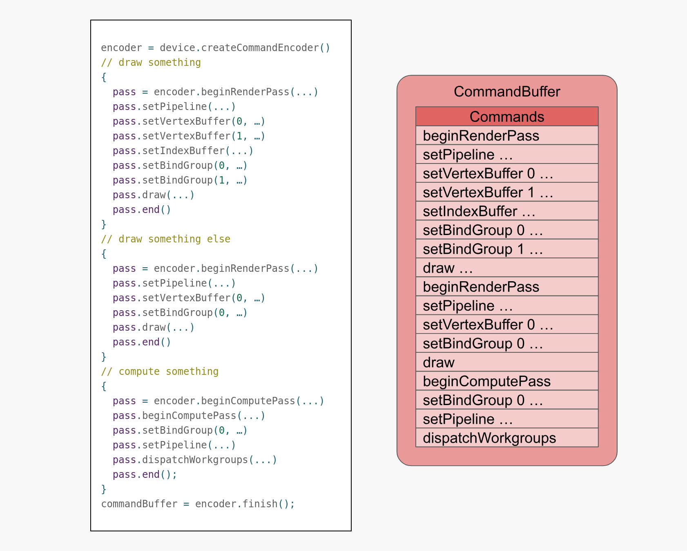

# webgpufundamentals.org

A tutorial on WebGPU.

Link: https://webgpufundamentals.org/webgpu/

This document summarizes and may contain quotes from this site.

## First Article: WebGPU Fundamentals

Link: https://webgpufundamentals.org/webgpu/lessons/webgpu-fundamentals.html

> WebGPU is an extremelty low-level API that lets you do 2 basic things
>
> 1. [Draw triangles/points/lines to textures](https://webgpufundamentals.org/webgpu/lessons/webgpu-fundamentals.html#a-drawing-triangles-to-textures)
> 2. [Run computations on the GPU](https://webgpufundamentals.org/webgpu/lessons/webgpu-fundamentals.html#a-run-computations-on-the-gpu)

There are lots more complex (and seeminly unrelated) stuffs that can be built upon "just" these two really primitive capabilities.

The low-level nature of WebGPU has some noticeable consequences:

- A large amount of applications can be built upon WebGPU. It's essentially a computer programming language.
- It's very verbose, as in assembly being verbose. So for general applications, just use a library.

### WebGPU overview

WebGPU is a simple system performing 3 types of work on the GPU:

- Vertex shader: For vertex position computation (in default mode, 3 vertices would be connected to create a triangle).
- Fragment shader: For pixel color computation. In default mode, when a triangle is drawn, each pixel will trigger a GPU call for your fragment shader, which returns a color.
- Compute shader: A function that will be executed N times. It will be triggered with an interation number by the GPU.

Quirks:

- The shaders run on the GPU:
  - The data must be made accessible to the GPU by being copied into buffers & textures.
  - The GPU only outputs to those buffers and textures.
  - The shader must be specified the bindings/locations to look for the data.
  - In JS, the buffers and textures should be bound to the bindings/locations.
  - After all is specified, we can tell the GPU to execute the function.

> Remarks: So basically, the JS side will create:
>
> - The shader.
> - The buffers/textures.
> - Bindings/Locations to buffers/textures will be specified to the shader.

The webgpufundamentals article provides the following visualization and more detailed explanation (albeit I find the diagram a bit confusing):


> Remark: In retrospect, this diagram represents the internal setup of GPU when at a "draw" command in the command buffer (shown in the next visualization). The "draw" command will trigger the GPU to execute a vertex shader.

- Pipeline: Containing the shaders the GPU will run. Besides that, the pipeline contains **attributes that reference buffers indirectly**. Attributes contain pointers to:
  - Vertex buffer.
  - Index buffer.
- Bind groups: Through which the **shaders** indirectly reference resources such as buffers, textures, samplers, etc.
  > Remark: Hmm why not just access via atributes? Maybe they need some isolation so shaders won't accidentally access a buffer that they aren't supposed to?
- Execution of a pipeline:
  1. The attributes read data from the buffers.
  2. The attributes feed data into the vertex shader.
  3. The vertex shader may feed data into the fragment shader.
  4. The fragment shaders use the **render pass description** to write to **textures**.
- Command buffers: Contain instructions for the GPU to execute. (See below)
  - Command encoder: Commands are encoded (like compiled) into the command buffer.
  - "Finish the encoder": The act of yielding the command buffer from the encoder.
  - "Submit the buffer": To have WebGPU execute the commands.

> Most WebGPU resources cannot be changed after creation. Contents may be changable though. We will need to recreate the resource if we want to change.

The following visualization about command buffers is from the page:



In the image above:

1. A command encoder is created.
2. Multiple render passes are created, inside each are some draw instructions.
3. The command buffer is built by triggering encoder finish.
4. As we can see, the output command buffers contain all render passed in one.

> Remark: This picture is the zoomed-out version of the diagram above. The "draw" command will setup the GPU's internal state similarly to that diagram.

### API Overview

The following sections illustrate the WebGPU API. It specifically shows how to setup WebGPU & how to perform the two use cases of WebGPU in JS.

#### Initialization

WebGPU is an async API. The setup has two parts:

- Acquiring a GPU device.

  ```javascript
  async function main() {
    const adapter = await navigator.gpu?.requestAdapter();
    const device = await adapter?.requestDevice();
    if (!device) {
      fail("need a browser that supports WebGPU");
      return;
    }
  }
  main();
  ```

  - `adapter` (JS): represents a specific physical GPU on the system. Some machines have multiple GPUs (e.g. integrated + discrete), so there may be multiple adapters.
  - `device` (JS): a logical handle/connection to the adapter. This is the main object used to create all WebGPU resources (buffers, textures, pipelines, etc.).
  - If `device` is undefined, the browser likely does not support WebGPU.

- Configuring the canvas.

  ```javascript
  const canvas = document.querySelector("canvas");
  const context = canvas.getContext("webgpu");
  const presentationFormat = navigator.gpu.getPreferredCanvasFormat();
  context.configure({
    device,
    format: presentationFormat,
  });
  ```

  - `canvas.getContext` is used to return a WebGPU context from the canvas.
  - `getPreferredCanvasFormat()` returns either `"rgba8unorm"` or `"bgra8unorm"` depending on the system. Using the preferred format is faster for the user's hardware.
    > Remark: Why isn't this the default, that is, why doesn't the canvas context configured to use the preferred canvas format by default?
  - `context.configure({ device, format })` associates the canvas with the device and sets the texture format for rendering.

#### Drawing Triangles to Textures

Link: https://webgpufundamentals.org/webgpu/lessons/webgpu-fundamentals.html#a-drawing-triangles-to-textures

> Overview: Here are the steps required to draw triangles to textures
>
> 1. Establish a GPU device & configure the context.
> 2. Create a shader module, written in WSGL, that is a compiled program with all the shaders.
> 3. Create a pipeline, supplying the shader module and wire up the entrypoints for vertex shader & fragment shader.
> 4. Create a render pass descriptor, wire up the pipeline with the textures to write to.
> 5. Encode multiple render pass descriptor into the command buffer, and submit the command buffer.

After initialization:

1. Create a shader module (a compiled WGSL program with multiple shader entrypoints) with `device.createShaderModule(...)`. Shaders are written in WGSL (pronounced "wig-sil"), a strongly typed language.

   The following is a JS code snippet from the site:

   ```javascript
   const module = device.createShaderModule({
     label: "our hardcoded red triangle shaders",
     code: /* wgsl */ `
       @vertex fn vs(
         @builtin(vertex_index) vertexIndex : u32
       ) -> @builtin(position) vec4f {
         let pos = array(
           vec2f( 0.0,  0.5),  // top center
           vec2f(-0.5, -0.5),  // bottom left
           vec2f( 0.5, -0.5)   // bottom right
         );
         return vec4f(pos[vertexIndex], 0.0, 1.0);
       }
   
       @fragment fn fs() -> @location(0) vec4f {
         return vec4f(1.0, 0.0, 0.0, 1.0);
       }
     `,
   });
   ```

   Remark: From a first glance:
   - `@vertex fn` probably declares a vertex shader.
   - `@fragment fn` probably declares a fragment shader.
   - `fn`s have signatures: `vs` accepts an `u32` vertex index and returns a `vec4f`.
   - Not sure what the `@builtin(...)` and `@location` do.

   According to the site:
   - The vertex shader:
     - `@vertex`, etc are **attributes**.
     - `vertexIndex` is a parameter.
     - `u32` is a type which stands for 32-bit unsigned integer.
     - `@builtin(vertex_index)` binds the `vertexIndex` to a builtin called `vertex_index` (it's an iteration number).
     - `vec4f` is a vector of four 32-bit floating point values.
     - `@builtin(position)` binds the returned value to the `position` builtin.
     - `array()` returns an array.
     - `vec2f` is a vector of two 32-bit floating point values.
   - WebGPU **positions** must be returned in **clip space** (coordinates in the range of \[-1, 1\]).
   - Note: In 2D, the 4 coordinates in `vec4f`:
     - `x`: The horizontal coordinate.
     - `y`: The vertical coordinate.
     - `z`: For depth-testing (like z-index).
     - `w`: For perspective divide.
   - The fragment shader:
     - `@fragment` is the attribute marking that it's a fragment shader function.
     - It accepts no parameters and returns a `vec4f`, bound to `@location(0)` (the first **render target**)
     - The returned value will represent the color in rgba.
     - The GPU will trigger the fragment shader to compute color for each pixel.
   - Labels (named object created with WebGPU) are optional but strongly recommended. WebGPU error messages include them. This is useful during debug.

2. Create a **render pipeline** with `device.createRenderPipeline(...)`.

   ```javascript
   const pipeline = device.createRenderPipeline({
     label: "our hardcoded red triangle pipeline",
     layout: "auto",
     vertex: { entryPoint: "vs", module },
     fragment: {
       entryPoint: "fs",
       module,
       targets: [
         {
           format: presentationFormat,
         },
       ],
     },
   });
   ```

   According to the site:
   - Layout: `layout: 'auto'` tells WebGPU to figure out the data layout by inspecting the shader code.
   - Vertex shader config:
     - The shader module is passed.
     - Entrypoint shader is the `vs` function.
   - Fragment shader config:
     - Similarly, we pass the shader module + the entrypoint shader.
     - `targets` is an array of **render target**, mirroring the `@location(n)` in WGSL. For example, `targets[0]` corresponds to `@location(0)` in the fragment shader.
   - Both `vertex` and `fragment` reference the same `module`, which makes sense since a shader module is just a container of functions and the pipeline picks the ones it needs.

   > Remark: `entryPoint` **can be omitted** when **each shader stage has only one matching function in the module**. If only one `@vertex` function exists there is nothing to disambiguate, so WebGPU can infer it automatically.

3. Create a **render pass descriptor** describing which texture to render to and how.

   ```javascript
   const renderPassDescriptor = {
     label: "our basic canvas renderPass",
     colorAttachments: [
       {
         // view: <- filled in at render time
         clearValue: [0.3, 0.3, 0.3, 1],
         loadOp: "clear",
         storeOp: "store",
       },
     ],
   };
   ```

   - `colorAttachments` is an array of render targets to write color output to, mirroring the `@location(n)` outputs of the fragment shader.
     - `view` specifies the actual texture to render into. It is left empty here and filled in each frame, because the canvas texture changes every frame and cannot be baked in at setup time.
     - `clearValue` is the color the texture is cleared to at the start of the pass, in rgba.
     - `loadOp` controls what happens to the texture before drawing.
       - `'clear'` wipes it to `clearValue`.
       - `'load'` preserves whatever was already there, which is useful when compositing multiple passes.
     - `storeOp` controls what happens to the draw result after the pass.
       - `'store'` keeps it.
       - `'discard'` throws it away, presumably for intermediate passes where you only care about side effects like depth writes rather than the color output.

   > Remark: The descriptor itself is a plain JS object, not a GPU resource. It is just configuration that gets read when you call `beginRenderPass`.

4. Encode the command into the command buffer and submit it.

   ```javascript
   function render() {
     renderPassDescriptor.colorAttachments[0].view = context
       .getCurrentTexture()
       .createView();

     const encoder = device.createCommandEncoder({ label: "our encoder" });
     const pass = encoder.beginRenderPass(renderPassDescriptor);
     pass.setPipeline(pipeline);
     pass.draw(3);
     pass.end();

     device.queue.submit([encoder.finish()]);
   }
   render();
   ```

   - `context.getCurrentTexture()` returns the canvas backbuffer for this frame.
     - Calling `.createView()` wraps it into a texture view, which is what the render pass expects.
     - The separation between a texture and a texture view probably exists to allow referencing sub-regions of a texture for better compositioning.
   - `pass.draw(3)` invokes the vertex shader 3 times, which by convention produces one triangle. Calling `draw(6)` would produce two triangles.
   - `setPipeline`, `draw`, and similar calls do not execute immediately. They only record commands into the command buffer. The GPU sees the work only when `device.queue.submit(...)` is called, which lets the driver batch and optimize the full sequence before sending anything to the hardware.
   - `encoder.finish()` seals the buffer, after which no more commands can be added and a new encoder would be needed.

#### Running Computations on the GPU

Link: https://webgpufundamentals.org/webgpu/lessons/webgpu-fundamentals.html#a-run-computations-on-the-gpu

The setup is identical to the triangle example: acquire an adapter and device. The difference starts at the shader module.

1. Create a **shader module** with a **compute shader**.

   ```javascript
   const module = device.createShaderModule({
     label: "doubling compute module",
     code: /* wgsl */ `
       @group(0) @binding(0) var<storage, read_write> data: array<f32>;
   
       @compute @workgroup_size(1) fn computeSomething(
         @builtin(global_invocation_id) id: vec3u
       ) {
         let i = id.x;
         data[i] = data[i] * 2.0;
       }
     `,
   });
   ```

   - `var<storage, read_write>` declares a buffer that the shader can both read from and write to. The `@group(0) @binding(0)` annotations tell the shader where to find it, to be wired up from JS later.
   - `@compute @workgroup_size(1)` marks the function as a compute shader entry point. `workgroup_size(1)` means each workgroup consists of a single invocation. This can be tuned for performance.
   - `@builtin(global_invocation_id)` gives each invocation a unique 3D index across all dispatched workgroups. Using `id.x` flattens it to a 1D index, which maps directly to an array position.

   The site provides a helpful pseudocode breakdown of how `dispatchWorkgroups` works:

   ```javascript
   // pseudo code

   // dispatchWorkgroups iterates over a 3D grid of workgroups.
   // Each cell in the grid becomes one workgroup_id passed to dispatchWorkgroup.
   function dispatchWorkgroups(width, height, depth) {
     for (z = 0; z < depth; ++z)
       for (y = 0; y < height; ++y)
         for (x = 0; x < width; ++x) dispatchWorkgroup({ x, y, z }); // launch one workgroup at this grid position
   }

   // dispatchWorkgroup runs all invocations within a single workgroup.
   // The workgroup_size comes from @workgroup_size(x, y, z) in the shader.
   // Each invocation gets a local_invocation_id within the workgroup,
   // and a global_invocation_id that is unique across all workgroups.
   function dispatchWorkgroup(workgroup_id) {
     const { x: w, y: h, z: d } = shaderCode.workgroup_size;
     for (z = 0; z < d; ++z)
       for (y = 0; y < h; ++y)
         for (x = 0; x < w; ++x) {
           const local_invocation_id = { x, y, z }; // position within this workgroup
           const global_invocation_id =
             workgroup_id * workgroup_size + local_invocation_id; // unique position across all workgroups
           computeShader(global_invocation_id); // run the shader for this invocation
         }
   }
   ```

   Since we used `@workgroup_size(1)`, each workgroup is exactly one invocation, so `global_invocation_id` equals `workgroup_id` directly. `id.x` then gives us a simple 1D loop index over the data array.

2. Create a compute pipeline.

   ```javascript
   const pipeline = device.createComputePipeline({
     label: "doubling compute pipeline",
     layout: "auto",
     compute: { module },
   });
   ```

   This is the compute equivalent of `createRenderPipeline`. There is no `vertex` or `fragment` stage, just `compute`.

3. Create buffers and upload input data.

   ```javascript
   const input = new Float32Array([1, 3, 5]);

   const workBuffer = device.createBuffer({
     label: "work buffer",
     size: input.byteLength,
     usage:
       GPUBufferUsage.STORAGE |
       GPUBufferUsage.COPY_SRC |
       GPUBufferUsage.COPY_DST,
   });
   device.queue.writeBuffer(workBuffer, 0, input);

   const resultBuffer = device.createBuffer({
     label: "result buffer",
     size: input.byteLength,
     usage: GPUBufferUsage.MAP_READ | GPUBufferUsage.COPY_DST,
   });
   ```

   - `STORAGE` is required for the buffer to be usable as a `var<storage,...>` in the shader.
   - `COPY_SRC` and `COPY_DST` are needed to copy data between buffers.
   - A separate `resultBuffer` is needed because GPU buffers cannot be directly read from JS. Only buffers created with `MAP_READ` can be mapped, and a buffer cannot have both `STORAGE` and `MAP_READ` usage at the same time, hence the two-buffer design.

4. Create a bind group to wire the buffer to the shader.

   ```javascript
   const bindGroup = device.createBindGroup({
     label: "bindGroup for work buffer",
     layout: pipeline.getBindGroupLayout(0),
     entries: [{ binding: 0, resource: workBuffer }],
   });
   ```

   - `getBindGroupLayout(0)` retrieves the layout for `@group(0)` from the pipeline. This mirrors how `targets` in the render pipeline mirrored `@location(n)` in the fragment shader.
   - `binding: 0` corresponds to `@binding(0)` in the shader.

5. Encode and submit.

   ```javascript
   const encoder = device.createCommandEncoder({ label: "doubling encoder" });
   const pass = encoder.beginComputePass({ label: "doubling compute pass" });
   pass.setPipeline(pipeline);
   pass.setBindGroup(0, bindGroup);
   pass.dispatchWorkgroups(input.length);
   pass.end();

   encoder.copyBufferToBuffer(
     workBuffer,
     0,
     resultBuffer,
     0,
     resultBuffer.size,
   );

   device.queue.submit([encoder.finish()]);
   ```

   - `dispatchWorkgroups(3)` runs the compute shader 3 times, once per element. Each invocation gets a different `global_invocation_id`, so `id.x` will be 0, 1, and 2 respectively.
   - `copyBufferToBuffer` is recorded as a command in the same encoder, after the compute pass. This means the copy happens after the compute shader finishes, within the same submission.

6. Read back the result.

   ```javascript
   await resultBuffer.mapAsync(GPUMapMode.READ);
   const result = new Float32Array(resultBuffer.getMappedRange());
   console.log("input", input);
   console.log("result", result);
   resultBuffer.unmap();
   ```

   - `mapAsync` is asynchronous because it waits for the GPU to finish executing the submitted commands before making the buffer accessible to JS.
   - `getMappedRange()` returns an `ArrayBuffer` view into the mapped memory. Wrapping it in `Float32Array` gives typed access.
   - `unmap()` must be called when done. The mapped view becomes invalid after this point.

   > Remark: The two-buffer pattern (`workBuffer` for GPU, `resultBuffer` for readback) is a recurring pattern in compute workflows. The GPU cannot write to a mappable buffer directly, so you compute into a `STORAGE` buffer and then copy to a `MAP_READ` buffer.

> Takeaway: WebGPU just runs shaders. Everything useful is built on top of that. What makes it powerful is that these shaders run on the GPU, which can have over 10,000 processors. That means potentially more than 10,000 calculations in parallel, which is likely 3 or more orders of magnitude more than a CPU can do in parallel.

#### Pitfall: Canvas Resizing

Link: https://webgpufundamentals.org/webgpu/lessons/webgpu-fundamentals.html#a-resizing

CSS can make a canvas visually fill the page, but it does not change the canvas's actual resolution. The default canvas size is 300x150 pixels, so stretching it with CSS just produces a blurry, pixelated result. To fix this, you need to update `canvas.width` and `canvas.height` in response to size changes.

The correct approach is to use a `ResizeObserver`:

```javascript
const observer = new ResizeObserver((entries) => {
  for (const entry of entries) {
    const canvas = entry.target;
    const width = entry.contentBoxSize[0].inlineSize;
    const height = entry.contentBoxSize[0].blockSize;
    canvas.width = Math.max(
      1,
      Math.min(width, device.limits.maxTextureDimension2D),
    );
    canvas.height = Math.max(
      1,
      Math.min(height, device.limits.maxTextureDimension2D),
    );
  }
  render();
});
observer.observe(canvas);
```

- Canvas dimensions must be clamped between `1` and `device.limits.maxTextureDimension2D`. Setting a size of `0` or exceeding the device limit causes a WebGPU error.
- The observer fires at least once on initialization, so calling `render()` inside it covers the first frame.
- `context.getCurrentTexture()` inside `render()` always returns a texture matching the current canvas size, so no other changes are needed.

> Remark: This approach does not handle high-DPI displays or zoom level changes. Those cases require reading `devicePixelRatio` and are covered in a dedicated resizing article.
